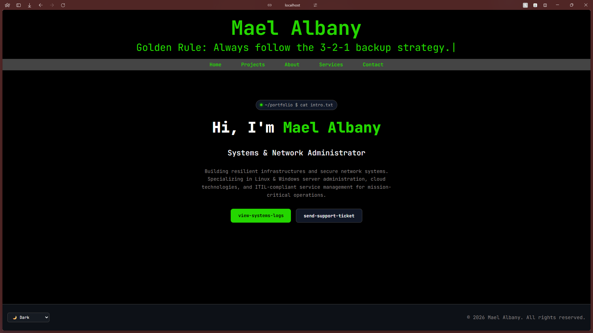

# Portfolio Website — Mael Albany

[](https://react.dev/)
[](https://vitejs.dev/)
[](https://opensource.org/licenses/MIT)



A personal portfolio website built with React and Vite, showcasing my projects, services, skills, and contact information.

[🌐 Live Demo](https://mael-albany.vercel.app/) 

## Description

This portfolio is designed to present my work and professional profile in a clean, modern, terminal-inspired responsive single-page application. It includes:

- **Interactive Hero Section** with typing effect (`typewriter-effect`)
- **Services Overview** listing key competencies
- **Projects Gallery** with dynamic card stacks and JSON data
- **About Section** detailing background and tech stack
- **Contact Form** with direct social links
- **Multi-Theme Switcher** (Dark, Light, Cyberpunk) with `localStorage` persistence

## Technologies Used

- **Frontend:** React, JavaScript (ES6+), CSS3
- **Build Tool:** Vite
- **Data:** JSON for project details
- **Design System:** CSS Custom Properties (Variables) with dynamic theme support

## Project Structure

```text
site-perso/
├── public/
│   └── favicon.svg
├── src/
│   ├── components/
│   │   ├── about.jsx
│   │   ├── card.jsx
│   │   ├── contacts.jsx
│   │   ├── footer.jsx
│   │   ├── header.jsx
│   │   ├── home.jsx
│   │   ├── navbar.jsx
│   │   ├── projects.jsx
│   │   ├── services.jsx
│   │   └── themeSwitcher.jsx
│   ├── data/
│   │   └── projects.json
│   ├── App.css
│   ├── App.jsx
│   ├── index.css
│   └── main.jsx
├── package.json
├── vite.config.js
├── .gitignore
├── index.html
└── README.md